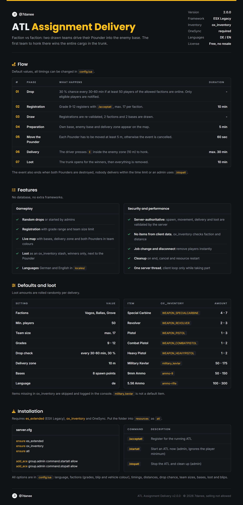
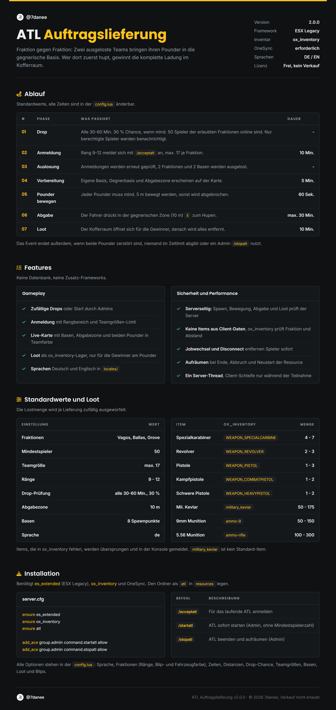

# ATL - Assignment Delivery

<a href="https://github.com/7danee"></a> by [@7danee](https://github.com/7danee)

Faction vs faction Pounder delivery event for **ESX Legacy** and **ox_inventory**.

<details>
<summary><b>English overview</b></summary>



</details>

<details>
<summary><b>Deutsche Übersicht</b></summary>



</details>

## Installation

Requires [es_extended](https://github.com/esx-framework/esx_core), [ox_inventory](https://github.com/overextended/ox_inventory) and OneSync.

```bash
git clone https://github.com/7danee/atl.git
```

Move the `atl` folder into your `resources` and add to your `server.cfg`:

```cfg
ensure es_extended
ensure ox_inventory
ensure atl

add_ace group.admin command.startatl allow
add_ace group.admin command.stopatl allow
```

All options are in `config.lua`.

## License

© 2026 [@7danee](https://github.com/7danee). Free to use and modify, **selling is not allowed**. See [LICENSE](LICENSE).
